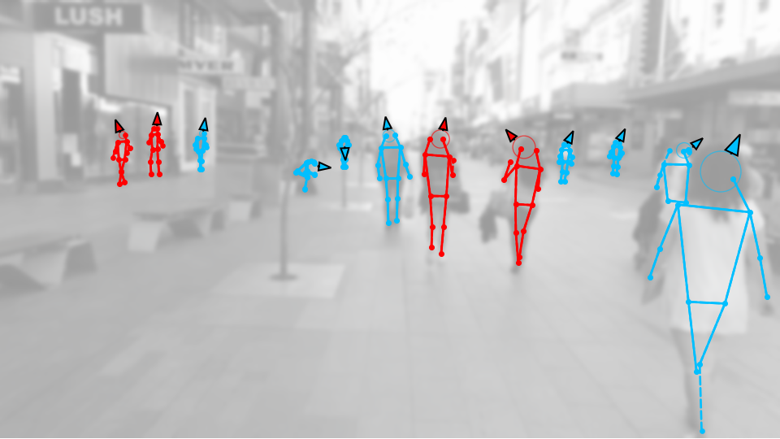

# Monoloco for Social Distancing

We adapted MonoLoco to detect social distance, check out our [Video](https://www.youtube.com/watch?v=r32UxHFAJ2M)
and the [Project Page](https://www.epfl.ch/labs/vita/research/perception/monoloco/).

Body Poses are obtained from Pifpaf pose detector: [openpifpaf](https://github.com/vita-epfl/openpifpaf).

This work is also built on preliminary studies on orientation from [Jean Marc Bejjiani](https://github.com/Parrotlife/orient-dim-pos-estimation).



Some details of the algorithm:

* No real images are captured, nor stored nor shown
* No calibration needed
* Works in real-time on any fixed or moving camera (such as a mobile phone)
* Analyzes not only the distance of people but also social interactions, such as their body pose and their orientation.  This is crucial as two people facing each other are at greater risk of contagion than when facing away
* More accurate than location-based technology since it can detect if two people are (not) facing each other


### Note on the version
This is a Beta Version. We are working on it and currently supporting inference with pre-trained models. More is yet to come.
For training, evaluation or webcam usage we suggest the [master branch](https://github.com/vita-epfl/monoloco).


### Install
Python 3 is required. Python 2 is not supported.

Clone the repository and install the following packages.

```
pip3 install torch<=1.1.0
pip3 install Pillow<=6.3
pip3 install torchvision<=0.3.0
pip3 install openpifpaf<=0.9.0
```

### Inference
Inference to compute social-distance warnings (as well as 3D localization and orientation) supports two options:
* loading 2D poses from json files
* analyzing images directly with Pifpaf

The predict script receives an image (or an entire folder using glob expressions).

For example on a folder of images:
```
python -m monoloco.run predict 
--social 
--glob "data/images/*.png" 
--networks monoloco 
--output_type front bird   
--model data/models/monoloco-191018-1459.pkl 
-o data/output --z_max 10
 ```

To load the corresponding json file of Pifpaf (instead of running the pose detector) add the command 

`--json_dir <directory of json files>`

The program automatically looks for a json file with the name of the image.

For more options check
`python3 -m monoloco.run predict --help` or the master branch.

### Pre-trained Models
* Download the MonoLoco pre-trained model from 
[Google Drive](https://drive.google.com/open?id=1fS6Dqo6n_9HFgbRVbzGd1rIn0ANABCpz) and save it in `data/models` 
(default) or in any folder and call it through the command line option `--model <model path>`
* Pifpaf pre-trained model will be automatically downloaded at the first run. 
Three standard, pretrained models are available when using the command line option 
`--checkpoint resnet50`, `--checkpoint resnet101` and `--checkpoint resnet152`.
Alternatively, you can download a Pifpaf pre-trained model from [openpifpaf](https://github.com/vita-epfl/openpifpaf)
 and call it with `--checkpoint  <pifpaf model path>`

### Videos
Videos are not directly supported for now, but easily converted to images (and back to videos) using **FFMPEG**:

Video --> Images:

`ffmpeg -i original_video.mov -vf fps=6 frames/%03d.png`


Images --> Video:

`ffmpeg -r 6 -f image2 -i figures/images/%03d.png.front.png -pix_fmt yuv420p -vf "pad=ceil(iw/2)*2:ceil(ih/2)*2" processed_video.mp4`


### Images without calibration matrix
To accurately estimate absolute distance, the focal length is necessary. 
However, it is still possible to test Monoloco on social distance for images where the calibration matrix is not available. 
Absolute distances are not meaningful but relative distance still are. 
Parameters of the camera can be changed into network/process.py in the function *factory_for_gt*
